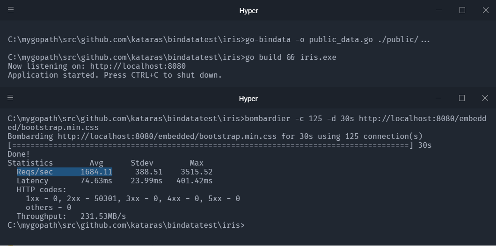
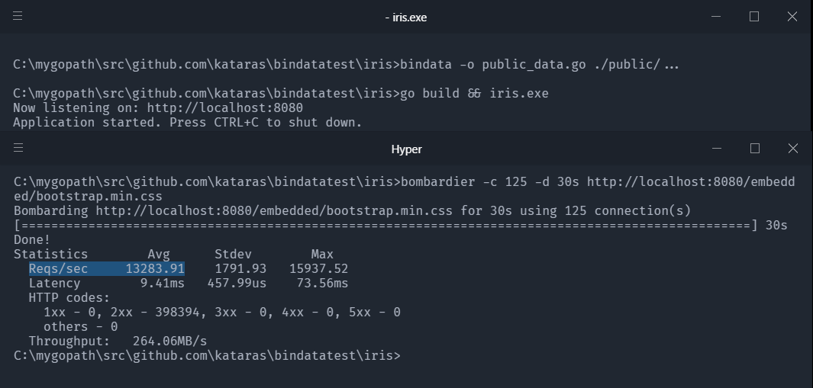

# Hello new `bindata` 

This package is a fork of the `go-bindata`. It's optimized by [@kataras](https://twitter.com/MakisMaropoulos) to maximize the performance on the [Iris web framework](https://iris-go.com) and generally, in http web servers written with [Go](https://golang.org).

This `bindata` package is **x7.887767220902613 times faster** than the original `go-bindata` in terms of web response.

## Reqs/sec with [shuLhan/go-bindata](https://github.com/shuLhan/go-bindata) and alternatives



## Reqs/sec with [kataras/bindata](https://github.com/kataras/iris)



# Bindata

This package converts any file into managable Go source code. Useful for
embedding binary data into a go program. The file data is gzip
compressed before and after converted to a raw byte slice.

It comes with a command line tool in the `cmd/bindata` sub directory.
This tool offers a set of command line options, used to customize the
output being generated.

## Installation

The only requirement is the [Go Programming Language](https://golang.org/dl/).

```sh
$ go get -u github.com/kataras/bindata/cmd/bindata
```

## Usage

Conversion is done on one or more sets of files. They are all embedded in a new
Go source file, along with a table of contents and an `Asset` function,
which allows quick access to the asset, based on its name.

The simplest invocation generates a `bindata_gzip.go` file in the current
working directory. It includes all assets from the `data` directory.

```sh
$ bindata ./data
```


To include all input sub-directories recursively, use the elipsis postfix
as defined for Go import paths. Otherwise it will only consider assets in the
input directory itself.

```sh
$ bindata ./data/...
```

To specify the name of the output file being generated, we use the following:

```sh
$ bindata -o data.go ./data/...
```

Multiple input directories can be specified if necessary.

```sh
$ bindata ./dir1/... ./path/to/dir2/...
```

The following paragraphs detail some of the command line options which can be 
supplied to `bindata`.

To ignore files, pass in regexes using -ignore, for example:

```sh
$ bindata -ignore=\\.gitignore ./data/...
```

### Static Files

```go
package main

import "github.com/kataras/iris/v12"

func main() {
    app := iris.New()
	app.HandleDir("/public", "./public", iris.DirOptions{
		Asset:      GzipAsset,
		AssetInfo:  GzipAssetInfo,
		AssetNames: GzipAssetNames,
		AssetValidator: func(ctx iris.Context, name string) bool {
			ctx.Header("Vary", "Accept-Encoding")
			ctx.Header("Content-Encoding", "gzip")
			return true
		},
	})
    // [...]
}
```

### Templates

Use the <https://github.com/shuLhan/go-bindata> for the templates as you used to do before the `kataras/bindata`. The `kataras/bindata` package doesn't support embedded templates, at least yet.

## Accessing an asset

To access asset data, we use the `GzipAsset(string) ([]byte, error)` function which
is included in the generated output (gziped).

```go
data, err := GzipAsset("pub/style/foo.css")
if err != nil {
    // Asset was not found.
}

// Use asset data...
```

## Debug vs Release builds

When invoking the program with the `-debug` flag, the generated code does
not actually include the asset data. Instead, it generates function stubs
which load the data from the original file on disk. The asset API remains
identical between debug and release builds, so your code will not have to
change.

This is useful during development when you expect the assets to change often.
The host application using these assets uses the same API in both cases and
will not have to care where the actual data comes from.

An example is a Go webserver with some embedded, static web content like
HTML, JS and CSS files. While developing it, you do not want to rebuild the
whole server and restart it every time you make a change to a bit of
javascript. You just want to build and launch the server once. Then just press
refresh in the browser to see those changes. Embedding the assets with the
`debug` flag allows you to do just that. When you are finished developing and
ready for deployment, just re-invoke `bindata` without the `-debug` flag.
It will now embed the latest version of the assets.


## Compression

Gzip Compression is enabled by-default and can't change.

- data saved gzip compressed
- output result is gzip compressed

For that reason, you have to include those two headers in your handlers:

```go
w.Header().Add("Vary", "Accept-Encoding")
w.Header().Add("Content-Encoding", "gzip")
```

## Path prefix stripping

Iris manages that automatically, for both templates and static files.

### Build tags

With the optional `-tags` flag, you can specify any go build tags that
must be fulfilled for the output file to be included in a build. This
is useful when including binary data in multiple formats, where the desired
format is specified at build time with the appropriate tags.

The tags are appended to a `// +build` line in the beginning of the output file
and must follow the build tags syntax specified by the go tool.
